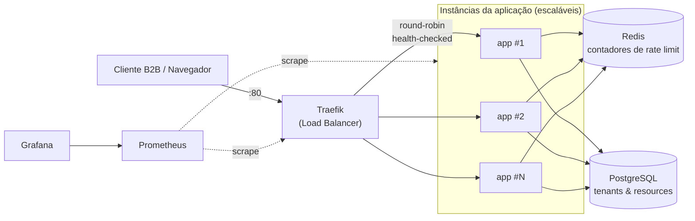

# Rate Limiter as a Service (RLS)

RLS é um serviço reativo de rate limiting multi-tenant: cada cliente (tenant) cadastra seus próprios
recursos e escolhe, por recurso, qual das cinco estratégias de limitação usar, com limite e janela
customizados. A cada requisição, o consumidor pergunta "essa chamada para este recurso, deste IP,
está autorizada agora?" e recebe uma resposta determinística, com os metadados necessários para
implementar backoff corretamente do lado do cliente.

O projeto foi construído como um exercício deliberado de arquitetura: hexagonal, Domain-Driven
Design, Test-Driven Development e Spec-Driven Development (via OpenSpec, ver `openspec/`),
com cada decisão documentada antes de ser implementada. Este README assume esse nível de leitura —
ele existe tanto como guia prático de uso quanto como registro arquitetural do sistema.

## Sumário

- [Visão geral e proposta de valor](#visão-geral-e-proposta-de-valor)
- [Diagrama de arquitetura](#diagrama-de-arquitetura)
- [Arquitetura em camadas](#arquitetura-em-camadas-hexagonal--ports--adapters)
- [As cinco estratégias de rate limit](#as-cinco-estratégias-de-rate-limit)
- [Resiliência](#resiliência)
- [Load balancing e escalabilidade horizontal](#load-balancing-e-escalabilidade-horizontal)
- [Observabilidade](#observabilidade)
- [Metodologia de desenvolvimento](#metodologia-de-desenvolvimento)
- [Guia de início rápido](#guia-de-início-rápido)
- [Testes de carga (k6)](#testes-de-carga-k6)
- [Guia de integração B2B](#guia-de-integração-b2b)
- [Estrutura do repositório](#estrutura-do-repositório)

## Visão geral e proposta de valor

Times de plataforma e empresas que expõem APIs precisam de rate limiting, mas quase sempre acabam
implementando isso de forma ad-hoc: um `Bucket4j` aqui, um contador em memória ali, sem
configurabilidade por cliente e sem sobreviver a mais de uma instância rodando ao mesmo tempo. O RLS
resolve isso como um serviço à parte:

- **Multi-tenant desde o design**: cada tenant tem seus próprios recursos, limites e política de
  fallback — não é uma configuração global compartilhada.
- **Cinco estratégias por recurso**: Fixed Window, Sliding Window Log, Sliding Window Counter, Token
  Bucket e Leaky Bucket (GCRA) — cada uma com um trade-off diferente entre precisão, memória e
  tolerância a burst (detalhado [abaixo](#as-cinco-estratégias-de-rate-limit)).
- **Stateless e horizontalmente escalável de verdade**: nenhuma instância guarda estado local — os
  contadores vivem no Redis, avaliados atomicamente via Lua, e a configuração de tenants/recursos
  vive no PostgreSQL. Escalar é `docker compose up --scale app=N`, sem coordenação adicional.
  Ver [Load balancing](#load-balancing-e-escalabilidade-horizontal).
- **Resiliente à falha da dependência de estado**: um circuit breaker protege o caminho crítico
  contra indisponibilidade do Redis, com política de fallback configurável por tenant/recurso
  (permitir ou negar durante a degradação).
- **Observável por padrão**: métricas Prometheus e um dashboard Grafana pré-provisionado mostram
  carga total e por instância sem nenhuma configuração manual.

## Diagrama de arquitetura

Visão de infraestrutura de alto nível — como uma requisição chega até uma instância da aplicação e
onde o estado compartilhado e a observabilidade se encaixam:



Nenhuma instância `app` guarda estado próprio: Redis e PostgreSQL são a única fonte de verdade
compartilhada, o que é o que torna o balanceamento round-robin acima seguro — qualquer instância
pode atender qualquer requisição, de qualquer tenant, a qualquer momento.

## Arquitetura em camadas (hexagonal / ports & adapters)

O reactor Maven é a própria expressão da arquitetura: cada módulo é uma camada ou um adapter, e o
grafo de dependências é estritamente unidirecional, de fora para dentro.

```
rls-domain  ←  rls-application  ←  { adapters }  ←  rls-bootstrap
```

| Módulo | Camada | Responsabilidade |
|---|---|---|
| `rls-domain` | Domínio | Modelo puro: aggregates, value objects e as cinco estratégias de rate limit. Zero dependência de framework, zero I/O. |
| `rls-application` | Aplicação | Use cases e ports (interfaces que o domínio define e os adapters implementam). Única exceção ao "zero framework": depende de `reactor-core` para expressar os use cases de forma reativa. |
| `rls-adapter-redis` | Adapter (saída) | Implementa `RateLimitEvaluationPort` contra o Redis — um script Lua atômico por estratégia. |
| `rls-adapter-persistence` | Adapter (saída) | Implementa `TenantRepositoryPort`, `ResourceRepositoryPort` e `SecretHasherPort` contra PostgreSQL via R2DBC, schema versionado por Flyway. |
| `rls-adapter-resilience` | Adapter (decorator) | Decora `RateLimitEvaluationPort` com um circuit breaker Resilience4j. |
| `rls-adapter-rest` | Adapter (entrada) | API REST reativa (`/api/v1/**`): onboarding, gestão de recursos, endpoint de check, autenticação por token. |
| `rls-adapter-web` | Adapter (entrada) | UI server-rendered em Thymeleaf (`/app/**`): auto-cadastro, login por sessão, dashboard de recursos — reaproveita os mesmos use cases da API REST, sem duplicar lógica. |
| `rls-bootstrap` | Composition root | O único módulo executável: monta cada porta com seu adapter real, expõe Actuator e é o alvo do `Dockerfile`. |

Nenhum adapter depende de outro adapter — a única forma de dois adapters "se falarem" é através de
um use case em `rls-application`. Isso é o que permite, por exemplo, trocar `rls-adapter-redis` por
outra implementação de `RateLimitEvaluationPort` sem tocar em `rls-adapter-rest` ou `rls-adapter-web`.

### Domain-Driven Design tático

O domínio está dividido em dois **bounded contexts**, que só se comunicam por identificadores
(`TenantId`, `ResourceId`), nunca por referência de objeto:

- **Tenant Management** (`domain.tenant` + `domain.resource`)
- **Rate Limiting Enforcement** (`domain.ratelimit`)

**Aggregates:**

- `Tenant` — aggregate root. Criado via `Tenant.register(name, email, passwordHash,
  defaultFallbackPolicy)` (valida campos obrigatórios e formato de e-mail) ou reidratado do banco
  via `Tenant.reconstitute(...)`. Tokens de API vivem como entidade filha (`ApiToken`), suportando
  rotação com histórico (`rotateApiToken` revoga o token ativo antes de emitir um novo).
- `RateLimitResource` — **aggregate root próprio, não filho de `Tenant`**. Essa é uma decisão de
  design deliberada: se um recurso fosse parte do aggregate `Tenant`, editar um único recurso exigiria
  travar o tenant inteiro. Como aggregate independente, `RateLimitResource` referencia seu tenant só
  por `TenantId`, e resolve sua política de fallback via `resolveFallbackPolicy(Tenant)` — se o
  recurso não tem uma política própria, herda a do tenant.

**Value objects** (todos com invariantes validados na construção, nunca em setters):
`RateLimitKey` (tenant + recurso + IP + estratégia — a chave real usada no Redis), `Quota` (limite,
janela, capacidade de burst opcional), `RateLimitDecision` (permitido/negado, limite, restante,
`resetAt`, `retryAfter` — obrigatório quando negado), `RateLimitState` (uma variante por estratégia),
`ClientIp`, `FallbackPolicy`.

Domain events (`TenantRegistered`, `ResourceConfigChanged`) existem como gancho arquitetural
documentado, mas **não foram implementados** — decisão deliberada para não introduzir mensageria/
outbox sem um caso de uso real que justifique.

## As cinco estratégias de rate limit

Cada tenant escolhe, por recurso, qual estratégia aplicar. Todas as implementações Redis compartilham
o mesmo contrato Lua: a chave é `rl:{tenantId}:{resourceId}:{ip}:{strategyCode}` (o código da
estratégia entra na chave para que trocar de estratégia num recurso não reaproveite, por engano, o
estado da estratégia anterior), e o tempo é lido com `redis.call('TIME')` **dentro** do script — nunca
enviado pela aplicação, o que eliminaria qualquer risco de *clock skew* entre instâncias.

| Estratégia | Estrutura no Redis | Como funciona | Trade-off |
|---|---|---|---|
| **Fixed Window** | `STRING` + `INCR`/`PEXPIRE` | Conta requisições dentro de uma janela fixa de tempo; zera ao virar a janela. O(1). | Permite até 2x o limite configurado na borda entre duas janelas — limitação clássica do algoritmo, não um bug. |
| **Sliding Window Log** | `ZSET` (score = timestamp) | Guarda o timestamp de cada requisição; `ZREMRANGEBYSCORE` remove as fora da janela antes de contar. | O mais preciso dos cinco, mas custa O(limite) de memória por chave — cada requisição fica retida até expirar. |
| **Sliding Window Counter** | `HASH{prev, curr}` | Interpola a contagem da janela anterior com a atual, proporcional ao tempo decorrido. O(1). | Suaviza o burst de borda do Fixed Window, mas é uma aproximação — não é exato como o Sliding Log. |
| **Token Bucket** | `HASH{tokens, last_refill}` | Um bucket é reabastecido continuamente, proporcional ao tempo decorrido, até uma capacidade máxima. | Permite burst configurável (até a capacidade do bucket) mantendo a taxa média de longo prazo. |
| **Leaky Bucket (GCRA)** | `STRING` (só o `TAT`) | Implementado via GCRA (Generic Cell Rate Algorithm — o mesmo padrão usado por Kong e Cloudflare), guardando apenas o *theoretical arrival time* da próxima requisição permitida. | Evita precisar de um processo de "vazamento" (drip) rodando em background, o que seria incompatível com múltiplas instâncias stateless. |

Cada estratégia também tem uma implementação **pura em Java** (sem Redis, sem I/O) em `rls-domain`,
usada tanto para TDD isolado quanto como *especificação executável*: `StrategyParityRedisAdapterIT`
roda a mesma sequência determinística de chamadas contra as duas implementações (Lua real e domínio
puro) e garante que concordam em cada passo. Em produção, quem decide é sempre o script Lua — é o
único capaz de garantir atomicidade sob concorrência real; a versão Java é a fonte da verdade
comportamental e o veículo do TDD.

## Resiliência

Existe **um único circuit breaker global** (`redis-rate-limit`, via Resilience4j), não um por
tenant — porque seu papel é detectar a saúde de uma dependência de infraestrutura compartilhada, e um
circuito por tenant diluiria essa detecção estatística. Configuração padrão (sobrescrevível por
variável de ambiente, ver `rls-bootstrap/src/main/resources/application.yml`):

| Parâmetro | Valor padrão |
|---|---|
| Taxa de falha para abrir o circuito | 50% |
| Tamanho da janela deslizante | 20 chamadas |
| Mínimo de chamadas para avaliar | 10 |
| Tempo em `OPEN` antes de testar `HALF_OPEN` | 30s |

O que **é** configurável por tenant/recurso é a política de fallback aplicada quando o circuito está
aberto:

- **`FAIL_OPEN`** — permite a requisição (prioriza disponibilidade sobre precisão do limite).
- **`FAIL_CLOSED`** — nega a requisição (prioriza estrita aplicação do limite sobre disponibilidade).

Toda decisão tomada com o circuito aberto é explicitamente marcada como `degraded=true`, e o
`/actuator/health` reflete o estado do circuito como `DEGRADED` (não `DOWN`) enquanto ele estiver
`OPEN` — a aplicação continua servindo tráfego via fallback, então não é uma falha total.

## Load balancing e escalabilidade horizontal

[Traefik](https://traefik.io) é o único ponto de entrada HTTP (`http://localhost`, porta 80). Ele
descobre réplicas do serviço `app` **automaticamente**, via labels do Docker (sem router estático
para manter atualizado), e distribui requisições round-robin apenas entre instâncias cujo
`/actuator/health` responde saudável.

O serviço `app` não publica porta nenhuma no host — essa é justamente a peça que viabiliza escalar
livremente: o Compose não permite duas réplicas disputando a mesma porta de host, então sem porta
fixa, `docker compose up --scale app=N` simplesmente sobe N contêineres na rede interna, e o Traefik
os descobre sozinho:

```
docker compose up -d --scale app=4
```

Não há *sticky sessions* — decisão deliberada, não uma lacuna. As sessões do dashboard web já são
externalizadas no Redis (`spring.session.store-type: redis`), então qualquer instância pode atender
qualquer sessão; rodar sem afinidade é o que efetivamente comprova que essa externalização funciona
sob round-robin real, em vez de mascarar uma eventual regressão.

## Observabilidade

- **Actuator** expõe só dois endpoints (todo o resto retorna `404` deliberadamente):
  `/actuator/health` (Redis, PostgreSQL/R2DBC e o estado do circuit breaker) e
  `/actuator/prometheus` (métricas Micrometer, incluindo as métricas do circuit breaker).
- **Prometheus** descobre cada réplica `app` via *service discovery* de DNS do Docker
  (`dns_sd_configs` contra o nome do serviço `app` — o Compose retorna um registro `A` por réplica
  ativa), então acompanha `--scale app=N` automaticamente, sem editar `prometheus.yml`. Faz scrape
  direto de cada instância — nunca através do Traefik, já que round-robin faria cada scrape "pular"
  de instância, quebrando a série temporal por réplica. O Traefik também é raspado, separadamente,
  para suas próprias métricas de roteamento.
- **Grafana** já vem com datasource e dashboard provisionados por arquivo — nenhum clique manual.
  O dashboard **Load Distribution** tem três painéis: taxa total de requisições, taxa por instância,
  e a porcentagem de carga de cada instância em relação ao total.

Acesso: Grafana em `http://localhost:3000` (`admin`/`admin`, uso local), Prometheus em
`http://localhost:9090`, dashboard do Traefik em `http://localhost:8081`.

## Metodologia de desenvolvimento

### Test-Driven Development

A pirâmide de testes é reforçada pelo próprio build: Surefire roda `*Test.java` (testes unitários,
sem dependências externas) e Failsafe roda `*IT.java` (integração, via Testcontainers) como fases
separadas do Maven — não dá para "esquecer" de rodar um dos dois em `mvn verify`.

- `rls-domain` é testado em JUnit5/AssertJ puro, **sem Spring, sem Mockito** — as cinco estratégias
  têm um `*StrategyTest` dedicado cada, mais um `StrategyInvariantsTest` cobrindo invariantes
  transversais (ex.: `remaining` nunca negativo, `allowed` nunca excede o limite).
- `rls-application` testa os use cases contra **fakes em memória** escritos à mão para cada port
  (`FakeRateLimitEvaluationPort`, `InMemoryResourceRepositoryPort`, `InMemoryTenantRepositoryPort`,
  `FakeSecretHasherPort`) — rápido, determinístico, sem Testcontainers.
- `rls-adapter-redis` e `rls-adapter-persistence` testam contra Redis/PostgreSQL **reais**, via
  Testcontainers — incluindo um teste de concorrência (`ConcurrencyRedisAdapterIT`) que dispara N
  chamadas paralelas na mesma chave e verifica que exatamente `limite` foram permitidas, provando
  atomicidade sob concorrência real, não apenas por leitura de código.
- `rls-bootstrap` fecha com testes ponta a ponta reais (`HappyPathE2EIT`,
  `CircuitOpenFallbackE2EIT`, `WebOnboardingAndDashboardE2EIT`, `ActuatorE2EIT`, entre outros),
  subindo a aplicação completa contra dependências reais.

### Spec-Driven Development (OpenSpec)

Nenhuma linha de código de produção foi escrita sem uma spec por trás. O projeto usa
OpenSpec (`openspec/config.yaml`, `schema: spec-driven`) com um ciclo fixo por
funcionalidade: **proposta → design → tasks → especificações delta**, uma branch `feature/<nome>`
por change, implementação guiada pelas tasks, e arquivamento sincronizando a spec delta para dentro
da spec principal da capability.

Isso não é um processo teórico — é o histórico real deste repositório. `openspec/specs/` tem hoje 19
capabilities documentadas (entre elas `rate-limit-strategy-evaluation`, `tenant-management`,
`resilient-evaluation-fallback`, `containerized-deployment`, `load-balancing`, `observability`,
`load-testing`, `metrics-dashboard`, `web-ui-styling`), e `openspec/changes/archive/` guarda os 10
changes que as produziram — cada um com seu `proposal.md` (o porquê), `design.md` (as decisões
técnicas e os trade-offs considerados) e `tasks.md` (o checklist de implementação), do domínio até o
front-end até a infraestrutura de observabilidade.

## Guia de início rápido

### Build

Requer JDK 21+, Maven e um daemon Docker rodando — os testes de integração de
`rls-adapter-redis` e `rls-adapter-persistence` sobem containers reais via Testcontainers.

```
mvn verify
```

Compila todos os módulos e roda a suíte completa (unit + integração). Relatório de cobertura JaCoCo
por módulo em `target/site/jacoco/index.html`. Para um módulo específico (e suas dependências):

```
mvn -pl rls-adapter-persistence -am verify
```

### Rodando localmente (sem Docker Compose)

`rls-bootstrap` é o artefato executável. Precisa de um Redis e um PostgreSQL reais (não só os
efêmeros do Testcontainers):

```
docker run -d --name rls-redis -p 6379:6379 redis:7-alpine
docker run -d --name rls-postgres -p 5432:5432 -e POSTGRES_USER=rls -e POSTGRES_PASSWORD=rls -e POSTGRES_DB=rls postgres:16-alpine
mvn -pl rls-bootstrap -am spring-boot:run
```

Configuração via `REDIS_HOST`/`REDIS_PORT`/`POSTGRES_HOST`/`POSTGRES_PORT`/`POSTGRES_DATABASE`/
`POSTGRES_USERNAME`/`POSTGRES_PASSWORD` (ver `rls-bootstrap/src/main/resources/application.yml`).
Flyway migra o schema automaticamente. Com a aplicação no ar, em `http://localhost:8080`:

| URL | O que é |
|---|---|
| `POST /api/v1/tenants` | Cadastro de tenant via API — ver [guia B2B](#guia-de-integração-b2b) |
| `/app/register` | Cadastro via dashboard web |
| `/app/login` | Login do dashboard (sessão, independente do token da API) |
| `/swagger-ui.html`, `/v3/api-docs` | Documentação interativa da API / OpenAPI cru |
| `/actuator/health` | Saúde, incluindo o estado do circuit breaker |
| `/actuator/prometheus` | Métricas no formato Prometheus |

### Rodando com Docker Compose (recomendado)

Sobe Redis, PostgreSQL, Traefik, a aplicação (escalável) e a stack de observabilidade
(Prometheus + Grafana) de uma vez:

```
docker compose up --build --scale app=2
```

| Serviço | URL |
|---|---|
| Aplicação (via Traefik) | `http://localhost` |
| Dashboard do Traefik | `http://localhost:8081` |
| Grafana | `http://localhost:3000` (`admin`/`admin`) |
| Prometheus | `http://localhost:9090` |

Escalar sem editar nenhum arquivo: `docker compose up -d --scale app=4`. Derrubar tudo:
`docker compose down` (ou `docker compose down -v` para também apagar o volume do Postgres).

## Testes de carga (k6)

`load-tests/` tem scripts [k6](https://k6.io) cobrindo o endpoint de check, onboarding de tenant,
CRUD de recursos e o fluxo de login web. Instale o k6 (binário único, sem gerenciador de pacotes —
[instruções aqui](https://grafana.com/docs/k6/latest/set-up/install-k6/)) e rode contra uma instância
no ar:

```
BASE_URL=http://localhost k6 run load-tests/check-rate-limit.js
BASE_URL=http://localhost k6 run load-tests/tenant-onboarding.js
BASE_URL=http://localhost k6 run load-tests/resource-crud.js
BASE_URL=http://localhost k6 run load-tests/web-auth.js
```

> **Atenção com `BASE_URL`**: o default é `http://localhost:8080` (a porta usada por
> `mvn spring-boot:run`). Contra o Docker Compose, a aplicação só é alcançável em
> `http://localhost` (porta 80, via Traefik) — a porta 8080 do host hoje não tem nada escutando.
> Esquecer de setar `BASE_URL` contra o Compose falha com conexão recusada, não com um erro
> confuso; isso já foi corrigido de propósito (o dashboard do Traefik costumava ficar na 8080 e
> mascarava esse esquecimento com um 404 enganoso).

Cada execução termina com uma seção **THRESHOLDS**: `✓`/`✗` por critério, e o processo sai com
código de erro se algum threshold falhar. Dois pontos de atenção ao ler o resultado:

- `check-rate-limit.js` excede o limite de propósito — ver `429`s no resultado é o comportamento
  esperado, não uma falha. O threshold em `http_req_failed` só sinaliza erro de infraestrutura de
  verdade (falha de rede, 5xx), já que `429` é explicitamente excluído dessa classificação neste
  script.
- `tenant-onboarding.js` e `resource-crud.js` criam linhas reais no PostgreSQL a cada execução e não
  limpam depois — pensados para um banco local/descartável. Rode `docker compose down -v` entre
  execuções repetidas se quiser um estado limpo.

## Guia de integração B2B

Este guia é para o desenvolvedor de uma empresa cliente que vai consumir a API do RLS para proteger
os próprios endpoints com rate limiting. Toda a integração acontece sob `/api/v1/**`, autenticada por
token Bearer — independente e completamente separada do dashboard web (`/app/**`, autenticado por
sessão).

### 1. Onboarding: crie sua conta

```bash
curl -X POST http://localhost/api/v1/tenants \
  -H "Content-Type: application/json" \
  -d '{"name": "Acme Inc", "email": "platform@acme.com", "password": "s3nhaForte!"}'
```

```json
{
  "tenantId": "2c6d99bc-db5d-4fec-8d2c-ded4d7d0aabe",
  "apiToken": "rls_live_eXCgbstKVVTnFJg8b7roho_Wsbr-7aU8"
}
```

**O `apiToken` é mostrado uma única vez.** Guarde-o com segurança — não há como recuperá-lo depois,
só rotacioná-lo (passo 5). Todas as chamadas autenticadas usam
`Authorization: Bearer <apiToken>`.

### 2. Configure um recurso

Um "recurso" é o que você quer proteger — um endpoint seu, uma ação, o que fizer sentido no seu
domínio. Cada recurso tem sua própria estratégia, limite e janela:

```bash
curl -X POST http://localhost/api/v1/resources \
  -H "Authorization: Bearer $API_TOKEN" \
  -H "Content-Type: application/json" \
  -d '{
    "resourceKey": "/checkout",
    "strategyType": "TOKEN_BUCKET",
    "limit": 100,
    "windowSeconds": 60,
    "burstCapacity": 150
  }'
```

`strategyType` aceita `FIXED_WINDOW`, `SLIDING_WINDOW_LOG`, `SLIDING_WINDOW_COUNTER`,
`TOKEN_BUCKET` ou `LEAKY_BUCKET` — ver a [tabela de estratégias](#as-cinco-estratégias-de-rate-limit)
para escolher a certa para o seu caso. `burstCapacity` é opcional e só é aproveitado pelo Token
Bucket e pelo Leaky Bucket.

CRUD completo do recurso: `GET /api/v1/resources` (lista), `GET/PUT/DELETE /api/v1/resources/{id}`.

### 3. Verifique o limite a cada requisição

Este é o endpoint quente, chamado uma vez por requisição que você quer proteger:

```bash
curl -X POST http://localhost/api/v1/ratelimit/check \
  -H "Authorization: Bearer $API_TOKEN" \
  -H "Content-Type: application/json" \
  -d '{"resource": "/checkout", "clientIp": "203.0.113.42"}'
```

**Permitido** (`200 OK`):

```json
{
  "allowed": true,
  "limit": 100,
  "remaining": 97,
  "resetAt": "2026-08-13T20:31:00Z",
  "retryAfterSeconds": null,
  "strategy": "TOKEN_BUCKET"
}
```

**Negado** (`429 Too Many Requests`):

```json
{
  "allowed": false,
  "limit": 100,
  "remaining": 0,
  "resetAt": "2026-08-13T20:31:00Z",
  "retryAfterSeconds": 12,
  "strategy": "TOKEN_BUCKET"
}
```

Em ambos os casos, os headers de resposta trazem os mesmos dados no formato `RateLimit-*`
(compatível com o [rascunho de padrão IETF](https://datatracker.ietf.org/doc/draft-ietf-httpapi-ratelimit-headers/)),
para quem prefere ler de header em vez de parsear o corpo:

| Header | Presente quando | Significado |
|---|---|---|
| `RateLimit-Limit` | sempre | Limite configurado para o recurso |
| `RateLimit-Remaining` | sempre | Quanto ainda resta na janela/bucket atual |
| `RateLimit-Reset` | sempre | Epoch (segundos) de quando o limite reseta |
| `Retry-After` | só quando negado | Segundos até que valha a pena tentar de novo |

**Prática recomendada**: trate `429` com `Retry-After` como um sinal de backoff, não como um erro a
ser logado com severidade alta — é o comportamento esperado do sistema fazendo seu trabalho.

### 4. Rotacione seu token quando precisar

```bash
curl -X POST http://localhost/api/v1/tokens/rotate \
  -H "Authorization: Bearer $API_TOKEN"
```

Revoga o token atual e emite um novo (também mostrado uma única vez). O token antigo para de
funcionar imediatamente — coordene a troca do lado do seu sistema antes de rotacionar em produção.

### 5. Tratamento de erros

Erros seguem [RFC 7807](https://www.rfc-editor.org/rfc/rfc7807) (`ProblemDetail`):

```json
{
  "type": "about:blank",
  "title": "Not Found",
  "status": 404,
  "detail": "Resource not found: /checkout-v2"
}
```

| Status | Quando |
|---|---|
| `401 Unauthorized` | Token ausente, inválido ou revogado |
| `404 Not Found` | Recurso ou tenant não encontrado |
| `409 Conflict` | E-mail de tenant ou `resourceKey` já existe |
| `429 Too Many Requests` | Limite excedido (ver passo 3 — não é um erro do seu sistema) |

Documentação interativa completa (OpenAPI/Swagger) disponível em `/swagger-ui.html` contra qualquer
instância no ar.

## Estrutura do repositório

```
ratelimit_as_service/
├── rls-domain/               # Domínio puro: aggregates, VOs, as 5 estratégias
├── rls-application/          # Use cases + ports
├── rls-adapter-redis/        # Contadores distribuídos via Lua/Redis
├── rls-adapter-persistence/  # Tenants/recursos via R2DBC + Flyway
├── rls-adapter-resilience/   # Circuit breaker (Resilience4j)
├── rls-adapter-rest/         # API REST (/api/v1/**)
├── rls-adapter-web/          # Dashboard Thymeleaf + Tailwind (/app/**)
├── rls-bootstrap/            # Composition root — o executável
├── load-tests/               # Scripts de carga k6
├── grafana/                  # Provisionamento do dashboard (datasource + JSON)
├── prometheus.yml            # Configuração de scrape do Prometheus
├── docker-compose.yml        # Redis, Postgres, Traefik, app, Prometheus, Grafana
├── Dockerfile                # Build multi-stage da aplicação
├── docs/architecture-plan.md # Plano arquitetural original (contexto histórico)
└── openspec/                 # Specs e changes — o registro spec-driven do projeto
    ├── specs/                # Capabilities ativas (a especificação "atual" do sistema)
    └── changes/archive/      # Um diretório por change implementado (proposal/design/tasks)
```
